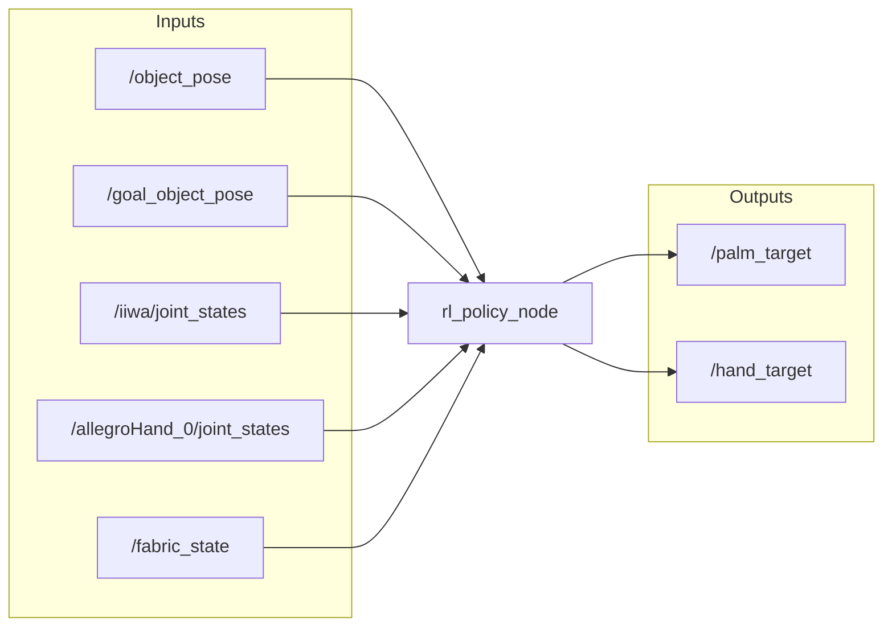
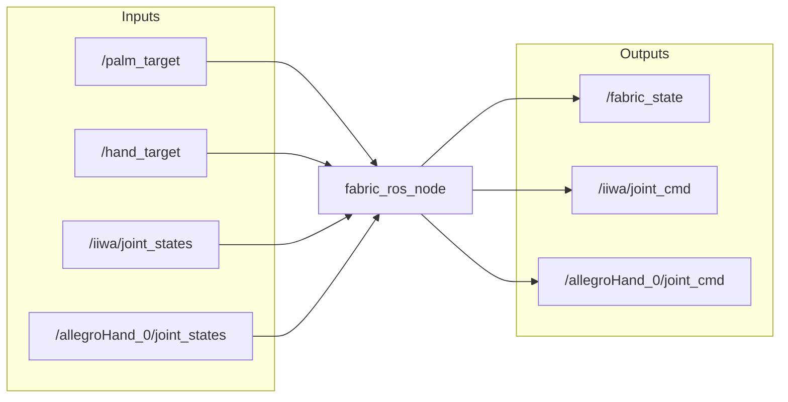
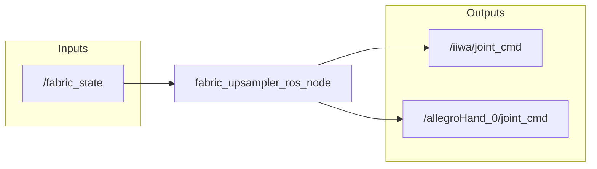

# Human2Sim2Robot: Crossing the Human-Robot Embodiment Gap with Sim-to-Real RL using One Human Demonstration

[Project Page](https://human2sim2robot.github.io/)

<!--  -->

https://github.com/user-attachments/assets/c9f75100-06fd-4f5f-8631-3ccdacab46d1

# Overview

This repository contains the official implementation of the Human2Sim2Robot framework, which was introduced in _Crossing the Human-Robot Embodiment Gap with Sim-to-Real RL using One Human Demonstration_. It consists of:

* Real-to-Sim: Digital twin creation for the robot, environment, and objects.

* Human Video Demonstration: Data collection and processing.

* Simulation-based Policy Learning: RL training in simulation to learn dexterous manipulation policies.

* Sim-to-Real: Policy deployment in the real world.

# Project Structure

```
human2sim2robot
  ├── assets
  │   └── // Assets such as robot URDF files, object models, etc.
  ├── data
  │   └── // Store raw video demos, processed demo data, etc.
  ├── docs
  │   └── // Documentation
  ├── pretrained_models
  │   └── // Pretrained models
  ├── runs
  │   └── // Simulation-based policy learning training runs
  └── human2sim2robot
      ├── // Source code
      └── hardware_deployment
      │  └── // Sim-to-real hardware deployment of policy
      └── human_demo
      │  └── // Human video demo collection and processing
      └── ppo
      │  └── // PPO training and evaluation
      └── real_to_sim
      │  └── // Real-to-sim digital twin creation
      └── sim_training
      │  └── // Simulation-based policy learning
      └── utils
         └── // Shared utilities
```

# Installation

Please see the [Installation](docs/installation.md) documentation for more details.

# Quick Start

Please run all commands from the root directory of this repository.

## Setup Zsh Tab Completion (Optional + Experimental + Fun)

For most scripts in this codebase, you can add `--help` after the script filepath to get the commandline arguments.

You can run commands even faster with tab completion. Run this to get tab completion for most scripts in this codebase. This is experimental and only works for `zsh` (not `bash`). This is just a small quality of life improvement, so feel free to skip it!

### Tyro Tab Completion
One-time run to set up tab completion (takes a minute):
```
python human2sim2robot/utils/setup_zsh_tab_completion.py
```

Run this in every new session (or put in `~/.zshrc` with the proper path):
```
fpath+=`pwd`/.zsh_tab_completion
autoload -Uz compinit && compinit
```

Now, for most scripts in the database, you will have tab autocompletion. For example:

```
python human2sim2robot/utils/download.py \
-
```

After the script filepath, you can enter a `-` and then press "TAB" to get auto-completion!

Note that this does not apply for the sim training script, which uses `hydra`.

### Hydra

For the sim training script, enable tab completion of commandline arguments by running the following (or putting this into your `.zshrc` with the proper path):

```
eval "$(python human2sim2robot/sim_training/run.py -sc install=bash)"
```

For example:

```
python human2sim2robot/sim_training/run.py \
te
```

You can now press "TAB" to get auto-completion!

WARNING: These two tab completions seem to conflict with each other. Thus, only use one at a time. Sorry :(

## Download Files

Fill out this [form](https://forms.gle/rUfrbuzKHW5BexcH6) to download the Human2Sim2Robot assets, data, and pretrained models. After filling out this form, you will receive a URL `<download_url>`, which will be used next.

NOTE: Navigating to `<download_url>` will take you to a forbidden page. This is expected. We use it in the steps below by setting this environment variable:

```
export DOWNLOAD_URL=<download_url>
```

First, we will download the assets, human demo raw data (all tasks), human demo processed data (all tasks), and pretrained models:

```
python human2sim2robot/utils/download.py \
--download_url ${DOWNLOAD_URL} \
--include_assets \
--all_tasks \
--include_human_demo_raw_data \
--include_human_demo_processed_data \
--include_pretrained_models
```

This should create folders for `assets`, `data/human_demo_raw_data/`, `data/human_demo_processed_data/`, and `pretrained_models`. To choose a specific task, you can replace `--all_tasks` with `--task_name <TASK_NAME>` (e.g., `snackbox_push`, `plate_pivotliftrack`).

## Real-to-Sim Digital Twin Creation

The goal of this section is to create a digital twin of the robot, objects, camera, and environment. The details for this section can be found in the [Real-to-Sim](human2sim2robot/real_to_sim/README.md) documentation.

Note that you can skip this section and simply use the provided digital twins in `assets/`.

## Human Demonstration

The goal of this section is to collect human video demonstrations of a task. The details for this section can be found in the [Human Demonstration](human2sim2robot/human_demo/README.md) documentation.

Note that you can skip this section and simply use the provided data in `data/human_demo_raw_data/` and `data/human_demo_processed_data/`.

For example:
```
export TASK_NAME=snackbox_push  # You can replace this with your task name (plate_pivotliftrack)
export OBJ_PATH=assets/kiri/snackbox/snackbox.obj  # You can replace this with your object obj path (assets/ikea/plate/plate.obj)
export FPS=30  # You can replace this with your FPS
```

You should have the following structure:

```
data/
├── human_demo_processed_data
│   └── $TASK_NAME
│       ├── hand_pose_trajectory
│       ├── object_pose_trajectory
│       └── retargeted_robot.npz
└── human_demo_raw_data
    └── $TASK_NAME
        ├── depth
        ├── rgb
        ├── masks
        ├── hand_masks
        └── cam_K.txt
```

You can run the following to create videos to visualize the data:

```
export VIDEOS_DIR=data/human_demo_videos/$TASK_NAME
mkdir -p $VIDEOS_DIR

# RGB
ffmpeg \
-framerate $FPS \
-i data/human_demo_raw_data/$TASK_NAME/rgb/%05d.png \
-c:v libx264 \
-pix_fmt yuv420p \
$VIDEOS_DIR/rgb.mp4

# Depth
ffmpeg \
-framerate $FPS \
-i data/human_demo_raw_data/$TASK_NAME/depth/%05d.png \
-c:v libx264 \
-pix_fmt yuv420p \
$VIDEOS_DIR/depth.mp4

# Object Masks
ffmpeg \
-framerate $FPS \
-i data/human_demo_raw_data/$TASK_NAME/masks/%05d.png \
-c:v libx264 \
-pix_fmt yuv420p \
$VIDEOS_DIR/masks.mp4

# Hand Masks
ffmpeg \
-framerate $FPS \
-i data/human_demo_raw_data/$TASK_NAME/hand_masks/%05d.png \
-c:v libx264 \
-pix_fmt yuv420p \
$VIDEOS_DIR/hand_masks.mp4

# Object Pose Trajectory
ffmpeg \
-framerate $FPS \
-i data/human_demo_processed_data/$TASK_NAME/object_pose_trajectory/track_vis/%05d.png \
-c:v libx264 \
-pix_fmt yuv420p \
$VIDEOS_DIR/object_pose_trajectory.mp4

# Hand Pose Trajectory
ffmpeg \
-framerate $FPS \
-i data/human_demo_processed_data/$TASK_NAME/hand_pose_trajectory/%05d.png \
-c:v libx264 \
-pix_fmt yuv420p \
$VIDEOS_DIR/hand_pose_trajectory.mp4
```

https://github.com/user-attachments/assets/484499ce-6256-4e2c-bd3f-b2c9bcd13678

Visualize the human demonstration in a 3D viewer (with only hand keypoints instead of full hand meshes):
```
python human2sim2robot/human_demo/visualize_demo.py \
--obj-path $OBJ_PATH \
--object-poses-dir data/human_demo_processed_data/$TASK_NAME/object_pose_trajectory/ob_in_cam \
--hand-poses-dir data/human_demo_processed_data/$TASK_NAME/hand_pose_trajectory/ \
--visualize-table
```

https://github.com/user-attachments/assets/e6d2d8b1-ec9a-4202-8b51-8710271d6178

Visualize the human demonstration in a 3D viewer (with full hand meshes, which is slower to load):
```
python human2sim2robot/human_demo/visualize_demo.py \
--obj-path $OBJ_PATH \
--object-poses-dir data/human_demo_processed_data/$TASK_NAME/object_pose_trajectory/ob_in_cam \
--hand-poses-dir data/human_demo_processed_data/$TASK_NAME/hand_pose_trajectory/ \
--visualize-table \
--visualize-hand-meshes  # This makes things slower to load, but you can see the full hand mesh
```

https://github.com/user-attachments/assets/4da1ed53-a75a-45e7-9737-eccde026b2e3

Visualize the human demonstration and the robot retargeted trajectory in a 3D viewer:
```
python human2sim2robot/human_demo/visualize_demo.py \
--obj-path $OBJ_PATH \
--object-poses-dir data/human_demo_processed_data/$TASK_NAME/object_pose_trajectory/ob_in_cam \
--hand-poses-dir data/human_demo_processed_data/$TASK_NAME/hand_pose_trajectory/ \
--visualize-table \
--robot-file iiwa_allegro.yml \
--retargeted-robot-file data/human_demo_processed_data/$TASK_NAME/retargeted_robot.npz \
--visualize-transforms
```

https://github.com/user-attachments/assets/26eb7b37-cdce-4a75-9aba-b1445d4ae5e6


## Simulation-based Policy Learning

https://github.com/user-attachments/assets/8832f9b8-aecb-4950-a6b6-3a6ce49dd384

https://github.com/user-attachments/assets/5dfe16dc-809e-40a0-ad71-298759c60302

The goal of this section is to train a policy in simulation using the processed human demonstration data and evaluate these policies in simulation. The details for this section can be found in the [Sim Training](human2sim2robot/sim_training/README.md) documentation.

For this step, you need data in `data/human_demo_processed_data/` as described above.


### Testing a Pre-trained Policy

If you have a pre-trained policy in the following directory:

```
export PRETRAINED_POLICY_DIR=pretrained_models/Experiment_snackbox_push_2025-03-28_10-33-38-374687
```

```
$PRETRAINED_POLICY_DIR
├── config_resolved.yaml
├── config.yaml
├── log.txt
└── nn
    └── best.pth
```

To test this pre-trained policy, run the following:

```
python human2sim2robot/sim_training/run.py \
--config-path ../../$PRETRAINED_POLICY_DIR \
--config-name config \
device_id=0 \
graphics_device_id=0 \
test=True \
num_envs=1 \
train.player.deterministic=False \
headless=False \
task.sim.enable_viewer_sync_at_start=True \
task.env.custom.enableDebugViz=False \
task.randomize=False \
checkpoint=$PRETRAINED_POLICY_DIR/nn/best.pth
```

Note that we have the `../../` because when we specify this config path as a relative path, it needs to be relative to the `sim_training` directory. If you specify the config path as an absolute path, you can remove the `../../`.

You can also run this other pretrained policy:

```
export PRETRAINED_POLICY_DIR=pretrained_models/Experiment_plate_pivotliftrack_2025-03-28_17-08-54-978176
```

From the simulator, you can press "R" to reset the environment and "E" to visualize debug visualizations.

### Training a New Policy

To train a policy, run the following:

```
export URDF_PATH=assets/kiri/snackbox/snackbox.urdf  # You can replace this with your object urdf path
export TASK_NAME=snackbox_push  # You can replace this with your task name
```

```
python human2sim2robot/sim_training/run.py \
task=CrossEmbodiment \
train=CrossEmbodimentPPOLSTM \
experiment=Experiment_$TASK_NAME \
wandb_group=my_wandb_group \
task.env.custom.ENABLE_FABRIC_COLLISION_AVOIDANCE=True \
task.env.custom.FABRIC_CSPACE_DAMPING=65 \
task.env.custom.FABRIC_CSPACE_DAMPING_HAND=5 \
task.env.controlFrequencyInv=4 \
task.env.custom.USE_CUROBO=True \
task.randomize=True \
randomization_params=RandomizationParams_medium \
task.env.custom.object_urdf_path=$URDF_PATH \
task.env.custom.retargeted_robot_file=data/human_demo_processed_data/$TASK_NAME/retargeted_robot.npz \
task.env.custom.object_poses_dir=data/human_demo_processed_data/$TASK_NAME/object_pose_trajectory/ob_in_cam \
headless=True \
device_id=0 \
graphics_device_id=0
```

You can remove `task.randomize=True` and `randomization_params=RandomizationParams_medium` if you want to train a policy without domain randomization.

This will train a policy and save the results in `runs/<experiment>_<timestamp>`, and this policy can be tested similar to above, but change:

```
export PRETRAINED_POLICY_DIR=runs/<experiment>_<timestamp>
```

You can also train using this different task:
```
export URDF_PATH=assets/ikea/plate/plate.urdf  # You can replace this with your object urdf path
export TASK_NAME=plate_pivotliftrack  # You can replace this with your task name
```

If you are using wandb, you can easily test a policy you see there by opening the associated run, go to "Overview", and then copy the command. Then go to "Files", then "runs", then `<experiment>_<timestamp>`, then "nn", then "best.pth", and then copy the URL. We put this together and add/remove some key arguments for testing.

```
test=True \
num_envs=1 \
train.player.deterministic=False \
headless=False \
task.sim.enable_viewer_sync_at_start=True \
task.env.custom.enableDebugViz=False \
checkpoint="https://wandb.ai/tylerlum/cross_embodiment/groups/my_wandb_group/files/runs/Experiment_snackbox_push_2025-03-27_11-16-39-387984/nn/best.pth\?runName\=Experiment_snackbox_push_2025-03-27_11-16-39-387984_v491d1sj"
```

Note that the URL is surrounded by double quotes, and the "?" and "=" are escaped with "\" (done automatically by the command line if you copy and paste the URL alone).

For full example:

```
python human2sim2robot/sim_training/run.py \
task=CrossEmbodiment \
train=CrossEmbodimentPPOLSTM \
experiment=Experiment_snackbox_push wandb_group=my_wandb_group \
task.env.custom.ENABLE_FABRIC_COLLISION_AVOIDANCE=True \
task.env.custom.FABRIC_CSPACE_DAMPING=65 \
task.env.custom.FABRIC_CSPACE_DAMPING_HAND=5 \
task.env.controlFrequencyInv=4 \
task.env.custom.USE_CUROBO=True \
task.randomize=True \
randomization_params=RandomizationParams_medium \
task.env.custom.object_urdf_path=assets/kiri/snackbox/snackbox.urdf \
task.env.custom.retargeted_robot_file=data/human_demo_processed_data/snackbox_push/retargeted_robot.npz \
task.env.custom.object_poses_dir=data/human_demo_processed_data/snackbox_push/object_pose_trajectory/ob_in_cam \
test=True \
num_envs=1 \
train.player.deterministic=False \
headless=False \
task.sim.enable_viewer_sync_at_start=True \
task.env.custom.enableDebugViz=False \
checkpoint="https://wandb.ai/tylerlum/cross_embodiment/groups/my_wandb_group/files/runs/Experiment_snackbox_push_2025-03-27_11-16-39-387984/nn/best.pth\?runName\=Experiment_snackbox_push_2025-03-27_11-16-39-387984_v491d1sj"
```

## Hardware Deployment

The goal of this section is to deploy the policy in the real world. The details for this section can be found in the [Hardware Deployment](human2sim2robot/hardware_deployment/README.md) documentation. For this step, you need to have a policy in `$PRETRAINED_POLICY_DIR` similar to above.

NOTE: The purpose of this documentation is NOT to be super precise and detailed, but rather to be a quick reference for how the hardware deployment roughly works.

### RL Policy Node

This is the RL policy we trained in simulation.


* `/object_pose` is the current 6D pose of the object to be manipulated
* `/goal_object_pose` is the desired 6D pose of the object
* `/iiwa/joint_states` provides the current joint states of the IIWA arm
* `/allegroHand_0/joint_states` provides the current joint states of the Allegro hand
* `/fabric_state` is the joint state of the geometric fabric controller
* `/palm_target` is a 6D vector (xyz position and euler RPY) for the palm that the robot should move towards, used by the geometric fabric controller
* `/hand_target` is a 5D vector controlling the robot hand, derived from PCA dimensionality reduction of the 16 joint angles to 5 eigengrasps

### Fabric ROS Node

This is the geometric fabric controller, which should run similarly to the one used during training.


* `/palm_target` is the 6D target pose (xyz position and euler RPY) for the palm from the RL policy
* `/hand_target` is the 5D eigengrasp vector for controlling the Allegro hand from the RL policy
* `/iiwa/joint_states` provides the current joint states of the IIWA arm
* `/allegroHand_0/joint_states` provides the current joint states of the Allegro hand
* `/fabric_state` publishes the current state of the geometric fabric controller
* `/iiwa/joint_cmd` outputs the joint position targets for the IIWA arm (not published if `PUBLISH_CMD = False`)
* `/allegroHand_0/joint_cmd` outputs the joint position targets for the Allegro hand (not published if `PUBLISH_CMD = False`)

### Fabric Upsampler ROS Node

The geometric fabric controller typically runs at 60Hz, but the robot arm and hand can run at 200-1000Hz. This node upsamples the fabric state positions (otherwise the 60Hz targets would be like "step changes"). This is visualized below.



* `/fabric_state` is the joint state of the geometric fabric controller at the standard rate (60Hz)
* `/iiwa/joint_cmd` outputs upsampled joint position targets for the IIWA arm (at 200Hz or 1000Hz)
* `/allegroHand_0/joint_cmd` outputs upsampled joint position targets for the Allegro hand (at 200Hz or 1000Hz)
* When using this node, set `PUBLISH_CMD = False` in the `fabric_ros_node` to avoid conflicting commands


Below, we show what the visualizer looks like:

https://github.com/user-attachments/assets/1d09b8f8-563d-4fc8-a03f-f7da7a0bd597

## Formatting

```
ruff check --extend-select I --fix human2sim2robot; ruff format human2sim2robot
```

# Citation

```
@misc{lum2025crossinghumanrobotembodimentgap,
        author = {Tyler Ga Wei Lum and Olivia Y. Lee and C. Karen Liu and Jeannette Bohg},
        title = {Crossing the Human-Robot Embodiment Gap with Sim-to-Real RL using One Human Demonstration},
        year = {2025},
        eprint = {2504.12609},
        archivePrefix = {arXiv},
        primaryClass = {cs.RO},
        url = {https://arxiv.org/abs/2504.12609},
      }
```

# Contact

If you have any questions, issues, or feedback, please contact [Tyler Lum](https://tylerlum.github.io/).
